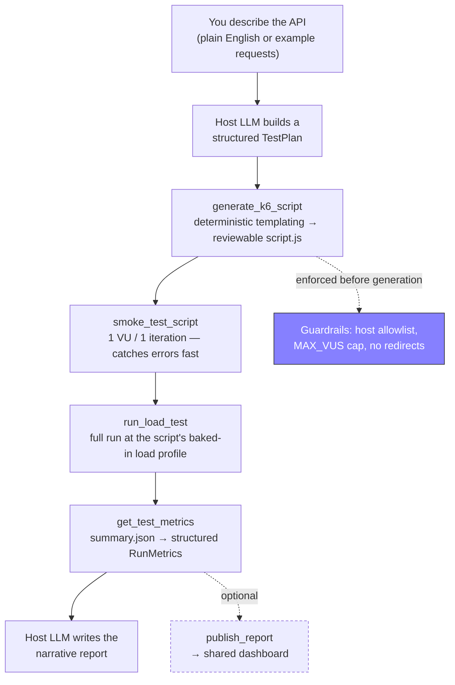
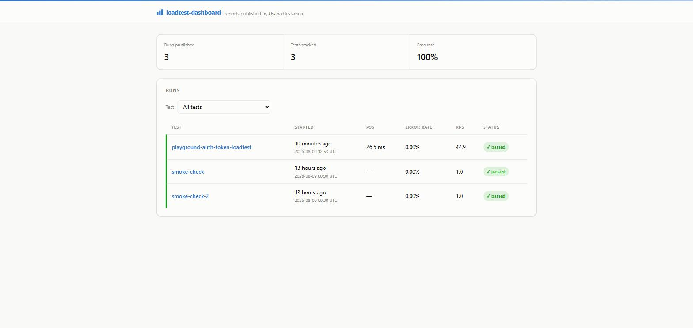
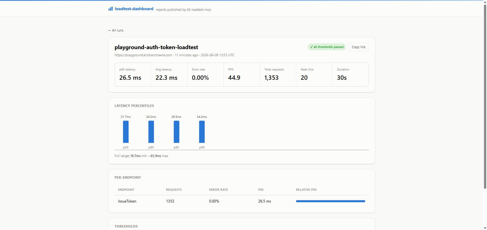

<div align="center">

# k6-loadtest-mcp

### Describe an API in plain English. Get a runnable k6 load test, executed and reported.


**[Pipeline](#pipeline) · [Guardrail](#guardrail) · [Setup](#setup) · [Tools](#tools) · [Dashboard](#dashboard) · [Try it live](#try-the-live-public-demo)**

</div>

This MCP server turns a plain-English API description (or a few example requests) into a runnable
[k6](https://k6.io) load test, runs it, and hands back structured, deterministic metrics — p50/p90/p95/p99
latency, error rate, RPS, per-endpoint breakdown, threshold pass/fail — for the host LLM (Claude Desktop /
Claude Code) to turn into a human-readable performance report.

It's an MCP server, not a standalone CLI: the "understanding what to test" step is done by whichever
Claude client you're using (no separate API key needed), and this server does the mechanical, deterministic
parts — script generation, execution, and result parsing — in code, so the numbers in the report are computed,
not guessed by an LLM eyeballing a log.

<details>
<summary><b>Example</b> — what asking for this looks like in conversation</summary>
<br>

```
You:    Load test my /checkout endpoint — ramp up to 50 concurrent users over 30s,
        fail me if p95 goes over 250ms.

Claude: Generated script.js, smoke-tested it (1 VU, clean), ran the full load profile...

        p95: 187ms   error rate: 0.2%   312 req/s   ✅ all thresholds passed

        Latency stayed well under budget through the ramp. The one failure was a
        single timeout at peak concurrency — worth a look if it recurs.
```

Illustrative — actual output depends on the API under test and the `TestPlan` the host LLM builds.

</details>

## Pipeline



`run_full_test` chains generate → smoke → run → parse in one call for convenience (and flags whether
a dashboard is configured, so Claude can ask before publishing — see [Dashboard](#dashboard)); the
granular tools let you inspect/adjust the script between
steps or re-run without regenerating.

## Guardrail

Load tests only run against hosts listed in `~/.k6-loadtest-mcp/config.json`'s `allowedHosts`
(`localhost`/`127.0.0.1` by default — the file is created automatically on first run). **The tools cannot
expand this list themselves** — hitting a host you don't control or aren't authorized to test can look like
a denial-of-service attack. Add a host yourself, by hand, once you've confirmed you're authorized to
load-test it:

```json
{ "allowedHosts": ["localhost", "127.0.0.1", "staging.myapp.example.com"] }
```

This lives under your home directory (override with `K6_LOADTEST_MCP_HOME`), not inside the installed package —
so it's in the same predictable place whether you cloned this repo, `npm install`ed it, or ran it via
`npx github:<owner>/k6-loadtest-mcp`. Run artifacts (`runs/<timestamp>-<name>/script.js`, `summary.json`, ...)
live alongside it at `~/.k6-loadtest-mcp/runs/`.

Two more guardrails, both enforced in code rather than through anything a `TestPlan` (agent-authored, possibly
prompt-injected) can control:

- **VUs are capped at `MAX_VUS` (1000)** in `src/types.ts` — a plan asking for more is rejected before a script
  is ever generated.
- **Generated requests don't follow redirects** (`redirects: 0`). The host allowlist only vets `baseUrl`;
  without this, a 3xx response could silently send load at a host that was never approved. A redirect just
  shows up as its own status code — set `expectStatus` to the 3xx code if a request is meant to test the
  redirect itself.

## Setup

Prerequisites: Node.js 18+, and [k6](https://k6.io/docs/get-started/installation/) installed and on your
`PATH` (or set `K6_BIN` to its full path).

```bash
npm install
npm run build
```

### Try it locally first

A tiny demo API (`demo/demo-api.mjs`) is included so you can see the whole pipeline work without pointing it
at anything real:

```bash
npm run demo-api        # starts http://localhost:4000 in one terminal
npm run harness          # in another terminal: generates a script, smoke-tests, runs a staged
                          # load test against it, and prints structured metrics
```

### Register with Claude Desktop / Claude Code

**Claude Code**, from a terminal (not inside a chat — there's no `/mcp add` slash command):

```bash
claude mcp add k6-loadtest-mcp -- node /absolute/path/to/k6-loadtest-mcp/dist/index.js
```

The command *after* `--` is what actually gets run — it must be `node <path-to-dist/index.js>`, not
just the path on its own (`claude mcp add k6-loadtest-mcp dist/index.js` without `node`/`--` doesn't
work; `claude` needs a real executable as `<commandOrUrl>`, not a script path). If you'll also want
the [dashboard](#dashboard) later, `-e` sets env vars on the server at registration time — the
reliable way to do it, see the note in [Pointing the MCP server at it](#pointing-the-mcp-server-at-it):

```bash
claude mcp add k6-loadtest-mcp -e K6_LOADTEST_DASHBOARD_TOKEN=<token> -- node /absolute/path/to/k6-loadtest-mcp/dist/index.js
```

**Claude Desktop**, edit `claude_desktop_config.json` directly:

```json
{
  "mcpServers": {
    "k6-loadtest-mcp": {
      "command": "node",
      "args": ["/absolute/path/to/k6-loadtest-mcp/dist/index.js"],
      "env": { "K6_LOADTEST_DASHBOARD_TOKEN": "<token>" }
    }
  }
}
```
(the `env` block is only needed if you're using the dashboard — omit it otherwise)

Or, once it's on a public GitHub repo, skip the local build entirely:

```json
{
  "mcpServers": {
    "k6-loadtest-mcp": {
      "command": "npx",
      "args": ["-y", "github:<owner>/k6-loadtest-mcp"]
    }
  }
}
```

**Either way, fully quit and restart Claude Desktop/Claude Code after registering or changing this**
— it spawns the MCP server once at startup and doesn't notice config or environment changes made
afterward. Retrying in the same conversation, or setting an env var in some other terminal window,
won't reach the already-running server; this bites people (it bit me while building this) far more
often than it should.

Then, in conversation: describe your API (or paste a few example `curl` commands), say what load profile you
want, and ask it to run and summarize a load test. The host LLM builds the structured `TestPlan` and drives
the four tools below.

## Tools

| Tool | Purpose |
|---|---|
| `generate_k6_script` | `TestPlan` → runnable k6 script + `runDir` |
| `smoke_test_script` | 1 VU / 1 iteration sanity check |
| `run_load_test` | Full run at the script's baked-in load profile |
| `get_test_metrics` | Parsed `summary.json` → structured `RunMetrics` |
| `run_full_test` | All of the above chained, given a `TestPlan` |
| `publish_report` | Publishes a run's metrics to a deployed [dashboard](#dashboard), returns a shareable URL |

### TestPlan shape

```jsonc
{
  "name": "checkout-api-smoke",
  "baseUrl": "http://localhost:4000",
  "requests": [
    { "name": "ListUsers", "method": "GET", "path": "/users", "weight": 5, "expectStatus": 200 },
    { "name": "GetReports", "method": "GET", "path": "/reports", "weight": 3, "maxDurationMs": 300 },
    { "name": "CreateOrder", "method": "POST", "path": "/orders", "weight": 2,
      "body": { "item": "widget", "qty": 1 }, "expectStatus": 201 }
  ],
  "loadProfile": {
    "type": "ramping",
    "stages": [{ "duration": "10s", "target": 10 }, { "duration": "20s", "target": 40 }, { "duration": "10s", "target": 0 }]
  },
  "thresholds": { "p95Ms": 250, "errorRatePct": 5 },
  "thinkTimeMs": 200
}
```

See `src/types.ts` for the full zod schema (also what the MCP client sees as the tool's input schema).

## Dashboard

By default, a report is whatever the host LLM types into the chat — useful in the moment, gone once
the conversation scrolls. `dashboard/` is an optional Spring Boot + Thymeleaf app you deploy once
(separately from the MCP server, not spawned by it) that your test runs get published to, giving you
a real, shareable URL instead. Every run also gets compared against the previous run of the same test
`name`, so latency/error-rate/RPS regressions show up automatically on the report page — no
separate baseline step.

It is **not required** — everything above works with zero dashboard configured, `publish_report`
just has nothing to publish to.

<p align="center">
  
  
</p>

Screenshots from the live public demo below — that run list is real, published by an actual
`run_full_test` call against a real API, not staged. Deploying your own private instance (further
down) works exactly the same way, just gated behind your own login instead of open to the internet.

### Try the live public demo

There's a real instance running at **[projects.krishanchawla.com/loadtest-dashboard](https://projects.krishanchawla.com/loadtest-dashboard/)**
— open to read without a login, and open to publish to as well, pinned to one target so it can't be
used as a general-purpose load-testing egress point (see [Public demo mode](#public-demo-mode) for
what that means). Point your own `k6-loadtest-mcp` at it:

1. Add `playground.krishanchawla.com` to `allowedHosts` in your own `~/.k6-loadtest-mcp/config.json`
   (the guardrail can't add this for you — see [Guardrail](#guardrail)):
   ```json
   { "allowedHosts": ["localhost", "127.0.0.1", "playground.krishanchawla.com"] }
   ```
2. Add the dashboard URL to that same file:
   ```json
   { "dashboardUrl": "https://projects.krishanchawla.com/loadtest-dashboard" }
   ```
   Then set the publish token **on the MCP server's own registration**, not as a plain shell env
   var — see [Register with Claude Desktop / Claude Code](#register-with-claude-desktop--claude-code)
   for why that distinction matters. For Claude Code, either re-add the server with `-e`:
   ```bash
   claude mcp add k6-loadtest-mcp -e K6_LOADTEST_DASHBOARD_TOKEN=0057371de9d3096616e06cd56a0872ae -- node /absolute/path/to/k6-loadtest-mcp/dist/index.js
   ```
   or add `"env": { "K6_LOADTEST_DASHBOARD_TOKEN": "0057371de9d3096616e06cd56a0872ae" }` to its entry
   in `.mcp.json`/`claude_desktop_config.json` directly. **Fully restart Claude Code/Desktop after
   this** — same reason as above, the running server won't pick it up otherwise.
   (Yes, that token is intentionally in this README — public demo mode's real guard is the pinned
   target, not the token; see the section linked above.)
3. Ask Claude to load test the playground's auth-token endpoint, e.g.:
   > Load test `POST https://playground.krishanchawla.com/api/scenarios/api-auth/token` with body
   > `{"username": "standard_user", "password": "Password123!"}`, ramp to 20 users over 20s.
4. Claude will notice a dashboard is configured and ask if you want this run published — say yes
   (or just ask directly) and you'll get back a real
   `projects.krishanchawla.com/loadtest-dashboard/runs/{id}` link, live for anyone to open.

Published runs are pruned after 3 days — it's a demo, not permanent storage. Only
`playground.krishanchawla.com` is accepted as a target; anything else gets a `403`.

### Deploying the dashboard

`dashboard/` is a self-contained Spring Boot jar (its own embedded server) — not a WAR dropped into
an existing Tomcat, even if you already run one. Modern Spring Boot targets Jakarta EE (`jakarta.*`),
which only deploys onto Tomcat 10+; Tomcat 9-and-older (`javax.*`) can't load it at all, and the last
Spring Boot version that could is 2.7.x, EOL since Nov 2023 — not worth it for a publicly reachable
service. Embedding its own server sidesteps the mismatch entirely and leaves any existing Tomcat
untouched.

```bash
cd dashboard
mvn -q package                 # -> target/loadtest-dashboard.jar
```

Run it (e.g. via systemd) with these env vars set:

| Env var | Required | Purpose |
|---|---|---|
| `DASHBOARD_API_TOKEN` | yes, to accept reports | Bearer token `publish_report` must send. Ingest returns 503 until this is set. No hardcoded fallback — leaving it unset doesn't silently open the endpoint, it disables it. |
| `DASHBOARD_BASIC_AUTH_USER` / `DASHBOARD_BASIC_AUTH_PASS` | no | HTTP Basic credentials guarding every page except `/api/**`. Set both → private, gated dashboard (the default posture, and what you want for your own/your team's real data). Leave `DASHBOARD_BASIC_AUTH_PASS` unset → reads are public — this is the deliberate [public demo mode](#public-demo-mode) posture, not a fallback-open bug. |
| `DASHBOARD_PUBLIC_BASE_URL` | yes, for correct links | The externally visible base URL (e.g. `https://loadtest.yourdomain.com`), used to build the shareable links `publish_report` returns. |
| `DASHBOARD_PORT` | no (default `8080`) | Port the embedded server listens on. |
| `DASHBOARD_DATA_DIR` | no (default `~/.k6-loadtest-mcp/dashboard`) | Where the H2 database file lives. |
| `DASHBOARD_DEMO_TARGET_HOST` | no | [Public demo mode](#public-demo-mode) only — pins accepted `baseUrl`s to one host\[:port\]. Unset = any target accepted (the private-use default). |
| `DASHBOARD_RETENTION_DAYS` | no (default `0` = off) | [Public demo mode](#public-demo-mode) only — auto-deletes runs older than N days, daily. `0`/unset = keep forever (the private-use default). |

```bash
# example systemd ExecStart -- private/team dashboard (default posture)
DASHBOARD_API_TOKEN=... DASHBOARD_BASIC_AUTH_USER=admin DASHBOARD_BASIC_AUTH_PASS=... \
DASHBOARD_PUBLIC_BASE_URL=https://loadtest.yourdomain.com \
java -jar /opt/loadtest-dashboard/loadtest-dashboard.jar
```

Point your existing nginx at it with one `location`/`proxy_pass` block to `127.0.0.1:8080` (or
whichever `DASHBOARD_PORT`) — no other nginx changes needed for this posture.

### Public demo mode

The default posture above (Basic Auth required, any `baseUrl` accepted, nothing pruned) is right for
your own or your team's real data. It is **not** meant for "clone the repo, point it at my dashboard,
anyone can see it" — once `DASHBOARD_API_TOKEN` is published (e.g. in this README), it's not a secret
anymore, and an unrestricted ingest endpoint becomes an anonymous load-testing egress point, not just a
spam nuisance.

Public demo mode trades the login for a narrower, self-limiting deployment: reads are open, but writes
are pinned to one fixed target — visitors get the real workflow (their own load test, their own report,
visible without a login) without being able to point your server at arbitrary hosts.

```bash
# example systemd ExecStart -- public demo, pinned to one trusted target
DASHBOARD_API_TOKEN=... \
DASHBOARD_PUBLIC_BASE_URL=https://projects.yourdomain.com \
DASHBOARD_DEMO_TARGET_HOST=your-safe-target.yourdomain.com \
DASHBOARD_RETENTION_DAYS=3 \
java -jar /opt/loadtest-dashboard/loadtest-dashboard.jar
# DASHBOARD_BASIC_AUTH_PASS deliberately not set
```

Two more things this posture needs that the default doesn't:

1. **Pick one target you're certain can take anonymous concurrent traffic**, and point
   `DASHBOARD_DEMO_TARGET_HOST` at it. Two ways to get one: deploy `demo/demo-api.mjs` (bundled with
   this repo — in-memory, no real data, built for exactly this) on your own box, or reuse an existing
   sandbox you already control, the way [the live demo above](#try-the-live-public-demo) pins to
   `playground.krishanchawla.com` — a practice API sandbox that already existed, not something stood
   up just for this. Either way, `DASHBOARD_DEMO_TARGET_HOST` checks host (and port, if given) only,
   not path — pinning to a host opens *everything* currently (and later) served from it, not just the
   one endpoint you had in mind.
2. **Rate-limit and cap the ingest endpoint at the nginx layer** — the in-app payload check
   (`ApiTokenFilter`) only catches requests that send a `Content-Length` header; nginx enforces it
   properly regardless of encoding, and rate limiting isn't something to reinvent in application code
   when the reverse proxy already does it well:

   ```nginx
   limit_req_zone $binary_remote_addr zone=dashboard_ingest:10m rate=5r/m;

   location /api/runs {
       limit_req zone=dashboard_ingest burst=5 nodelay;
       client_max_body_size 64k;
       proxy_pass http://127.0.0.1:8080;
   }
   ```

The bearer token still guards against casual/accidental hits, but in this mode `DASHBOARD_DEMO_TARGET_HOST`
is the real defense, not the token — treat it as public once it's in this README.

### Pointing the MCP server at it

Once deployed, two settings on the machine(s) running `k6-loadtest-mcp`:

- `dashboardUrl` in `~/.k6-loadtest-mcp/config.json` (same file `allowedHosts` lives in) — the
  dashboard's `DASHBOARD_PUBLIC_BASE_URL`, e.g. `"dashboardUrl": "https://loadtest.yourdomain.com"`.
  Not set by default; nothing is ever sent anywhere until you add it yourself.
- `K6_LOADTEST_DASHBOARD_TOKEN` — must match `DASHBOARD_API_TOKEN`. Kept out of `config.json`
  deliberately, since it's a secret and that file isn't. **Set this on the MCP server's own
  registration** (`claude mcp add ... -e K6_LOADTEST_DASHBOARD_TOKEN=...`, or an `"env"` block in
  `.mcp.json`/`claude_desktop_config.json` — see
  [Register with Claude Desktop / Claude Code](#register-with-claude-desktop--claude-code)), not as
  a plain shell/session env var. The server reads it once at startup; a variable set afterward in
  some other terminal, or "just retry" in the same conversation, never reaches the already-running
  process. This is the single most common way people (including while building this) get stuck here
  — if `publish_report` keeps saying the token isn't set after you're sure you set it, this is why.

With both set, `run_full_test`'s response includes `dashboardConfigured: true` — Claude is instructed
to ask before publishing, not do it automatically, since a run's data becomes visible on whatever
that dashboard's own access posture is (see [public demo mode](#public-demo-mode) vs. the private
default above). Call `publish_report` directly yourself at any point to (re-)publish a specific run,
including one driven through the granular tools instead of `run_full_test`.

## Notes on k6's summary JSON (v2.1.0, verified by inspection)

- Trend metrics (latencies): `avg/min/med/max/p(90)/p(95)`. `p(99)` is **not** included by default — the
  generated script always sets `summaryTrendStats` to request it explicitly.
- `med` is the p50 — there's no `p(50)` key.
- Rate metrics (`http_req_failed`, and this project's per-endpoint `failed_<name>` metrics): `value` is
  already a 0–1 fraction; `passes` is confusingly the count where the metric was *truthy* — for a "failed"
  metric, that means `passes` = the failure count, not the success count.
- A metric's `thresholds` object is keyed by the threshold expression with a **boolean that means "was this
  breached"**, the opposite of "passed" — e.g. a passing `p(95)<250` (p95 actually 200ms) is reported as
  `false`, matching the CLI's own `✓`. `src/k6/parseSummary.ts` inverts this back to a plain `ok` boolean.
  This was caught by cross-checking the JSON against the CLI's own `✓`/`✗` output during development — worth
  re-verifying if you upgrade k6.

## What's not here yet

- **Standalone CLI mode** — same pipeline, driven by a script with its own `ANTHROPIC_API_KEY` instead of an
  MCP host, for CI use. The core (`src/k6/*`, `src/types.ts`) is already host-agnostic; this would add a
  thin agent loop on top.
- **JMeter export** — k6 is the primary engine (LLM-friendly JS, clean JSON output); a JMX export path could
  be added via `openapi-generator`'s JMeter backend for orgs standardized on JMeter.
- **OpenAPI/Postman ingestion** — deriving the request mix automatically from a spec instead of the host LLM
  inferring it from a description.
- **CI-gate baseline diffing** — the [dashboard](#dashboard) already diffs each run against the previous run
  of the same test `name` for human viewing; failing a CI job on regression would need `publish_report`'s
  response (or a new dashboard endpoint) surfaced as a pass/fail exit code.
- **Auth token chaining** — `TestPlan` models a weighted mix of *independent* requests; there's no way to
  fetch a token in one request and reuse it in a later one, so anything needing a login step first (most
  real APIs) only works if you paste in a long-lived static token via `headers`. Found concretely while
  picking a target for the public demo above — `playground.krishanchawla.com`'s auth-flow sandbox needs
  exactly this and can't be fully exercised yet.

---

<div align="center">
<sub>Built by <a href="https://github.com/krishanchawla">Krishan Chawla</a> · <a href="https://krishanchawla.com">krishanchawla.com</a></sub>
</div>
